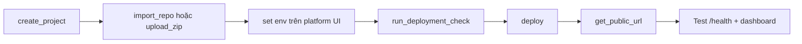

# Triển khai giải ONLINE (LIVE) — MCP Demo System

Hướng dẫn deploy server ALAN Monitor lên Internet qua **MCP Demo System** (đã kết nối trong Cursor).

---

## 1. Kiến trúc LIVE

```
Android App  ──wss──►  Demo System (TLS + public URL)  ──►  Node server (Docker)
Dashboard    ──https/wss──►  cùng URL
```

- Thiết bị thí sinh **chỉ kết nối ra** (outbound) — không cần mở port trên router nhà.
- App: **IP** = domain public (vd. `xxx.demo-system.dev`), **Port** = `443` → `wss://`.
- `DEPLOY_MODE=LIVE` → **tắt `/api/adb`** (không deploy file qua Internet).

---

## 2. Chuẩn bị code (local)

1. Đảm bảo có `Dockerfile` ở root repo (đã có).
2. Commit & push lên GitHub (`master`): `https://github.com/haialan283/monitor_ONLAN.git`  
   **Quan trọng:** Phải có `Dockerfile` ở root — nếu chưa push, platform sẽ detect nhầm `STATIC_HTML`.
3. `import_repo` lại (branch `master`) sau mỗi lần push lớn.

---

## 3. Biến môi trường (bắt buộc trên platform)

| Biến | Mô tả | Ví dụ |
|------|--------|-------|
| `SECRET_KEY` | Trùng app Android + dashboard | `MonitorTournamentSecretKey2026!` |
| `DEPLOY_MODE` | `LIVE` tắt ADB | `LIVE` |
| `PORT` | Port container (platform có thể inject) | `3333` |
| `DASHBOARD_ADMIN_PIN` | PIN admin | `****` |
| `DASHBOARD_VIEWER_PIN` | PIN viewer (tùy chọn) | `****` |
| `DISCONNECT_MS` | Ngưỡng mất kết nối (ms), LIVE nên 12000+ | `12000` |
| `NET_TCP_TIMEOUT_MS` | Probe mạng Internet | `8000` |
| `DISCORD_WEBHOOK_URL` | Webhook Discord (tùy chọn) | `https://discord.com/api/webhooks/...` |

---

## 4. Quy trình MCP (trong Cursor)

Thứ tự gọi tool `user-demo-system`:



### Bước 1 — Tạo project

```
create_project
  name: ALAN Monitor LIVE
  slug: alan-monitor-live
  sourceType: GITHUB
```

**Project đã tạo:** `projectId = cmqrt0mh2z2yhgc3gaa5ocs2o`

### Bước 2 — Import code

```
import_repo
  projectId: cmqrt0mh2z2yhgc3gaa5ocs2o
  repoUrl: https://github.com/haialan283/monitor_ONLAN.git
  branch: master
```

Hoặc `upload_zip` nếu chưa push GitHub (zip repo có `Dockerfile` ở root).

Không commit `server/.env` — secrets cấu hình trên Demo System.

### Bước 3 — Cấu hình env

Trên UI Demo System (hoặc tool env nếu có): đặt các biến ở mục 3.

`get_deployment_env_summary` — kiểm tra env đã inject (không lộ secret).

### Bước 4 — Kiểm tra & deploy

```
run_deployment_check  projectId: <id>
deploy                projectId: <id>
get_deployment_status projectId: <id>
get_logs              projectId: <id>
get_public_url        projectId: <id>
```

### Bước 5 — Xác minh

- `GET https://<public-url>/health` → `{ "ok": true, "deployMode": "LIVE", "adbEnabled": false }`
- Mở dashboard → đăng nhập PIN → thấy WebSocket “Đã kết nối”
- App Android: domain public, port `443`, cùng `SECRET_KEY`

---

## 5. Cấu hình app Android (thí sinh)

| Trường | Giá trị |
|--------|---------|
| IP | Domain từ `get_public_url` (không `https://`) |
| Port | `443` |
| Tên thiết bị | Tên đội / bàn |

Build APK với `wsSecretKey` trùng `SECRET_KEY` trên server (`gradle.properties` hoặc `-PwsSecretKey=...`).

---

## 6. Vận hành sau deploy

| Lệnh MCP | Khi nào |
|----------|---------|
| `restart` | Sau khi đổi env hoặc redeploy |
| `get_logs` | Debug lỗi WebSocket / crash |
| `stop` | Tắt giải / bảo trì |

Sau sửa code local: push GitHub → `import_repo` (hoặc upload) → `deploy` lại.

---

## 7. LAN vs LIVE

| | LAN | LIVE (Demo System) |
|--|-----|---------------------|
| `DEPLOY_MODE` | `LAN` (mặc định) | `LIVE` |
| ADB | Bật | Tắt |
| App URL | `ws://192.168.x.x:3333` | `wss://domain:443` |
| `DISCONNECT_MS` | 5000 | 12000+ |

---

*Tài liệu đi kèm `docs/ROADMAP_UPGRADE.md` — Phase 1.*
