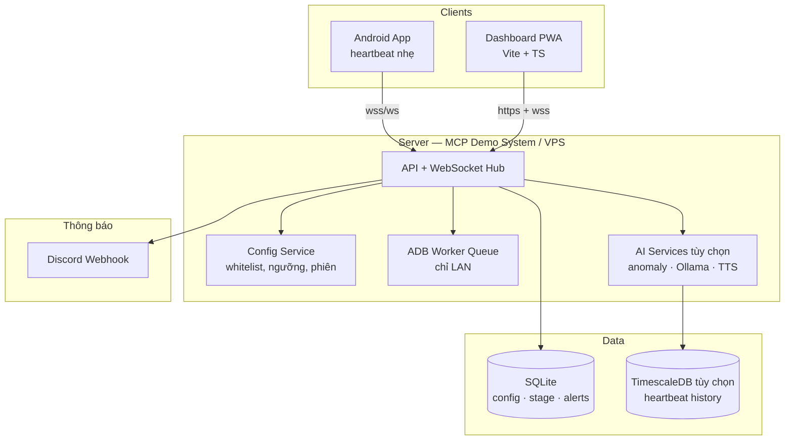
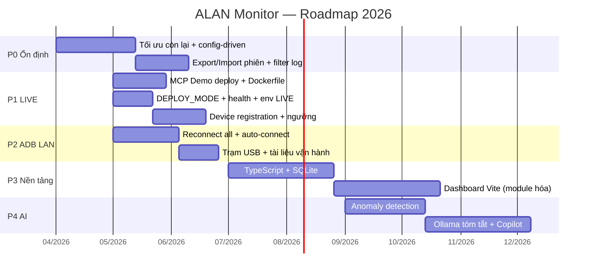
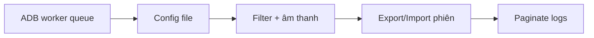
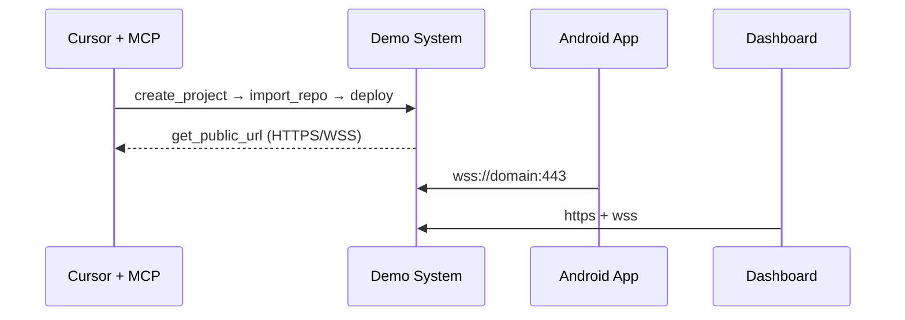
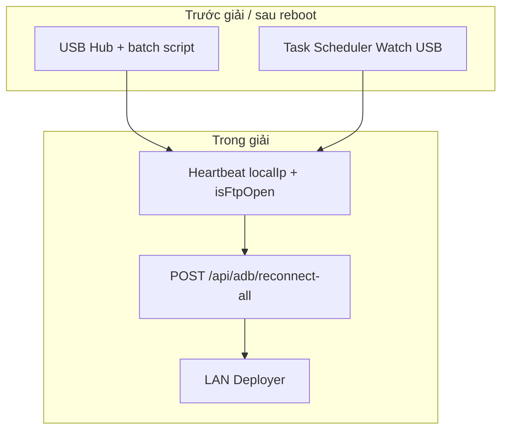
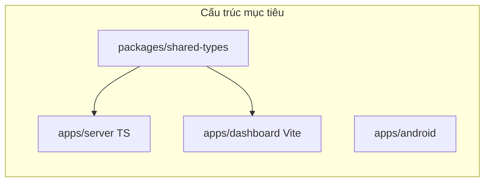
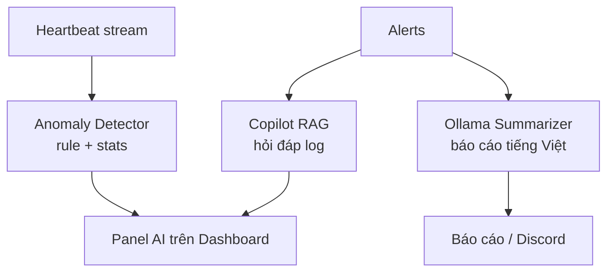
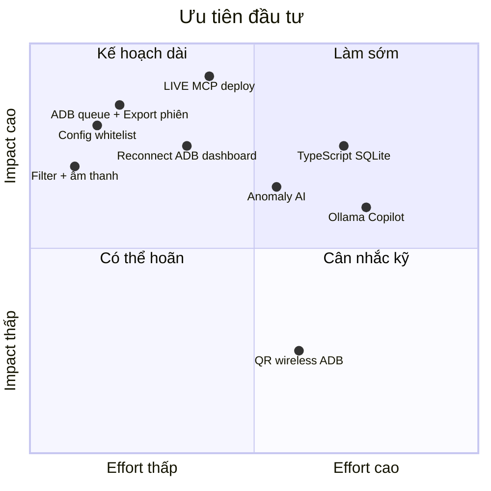
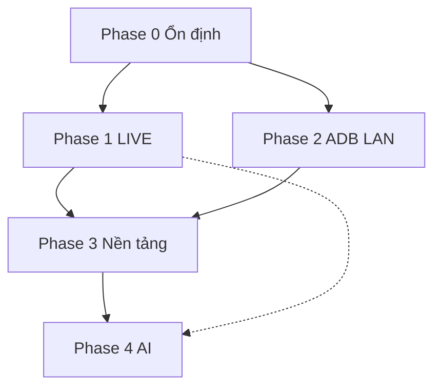

# ArenaPulse — Roadmap nâng cấp 2026

Tài liệu tổng hợp lộ trình phát triển từ trạng thái hiện tại (Android + Node.js + WebSocket + LAN) hướng tới: **vận hành ổn định**, **giám sát giải online (LIVE)**, **ADB LAN tối ưu**, **nền tảng hiện đại**, **AI hỗ trợ vận hành**.

**Nguyên tắc xuyên suốt:** Không làm nặng máy thi đấu · AI chạy trên server · Offline-first (LAN vẫn hoạt động khi mất Internet).

---

## 1. Tầm nhìn & kiến trúc mục tiêu



---

## 2. Timeline tổng thể



> **Triển khai LIVE:** dùng **MCP Demo System** trong Cursor (`docs/DEPLOY_LIVE.md`). **P0 → P1** là ưu tiên cao nhất.

---

## 3. Trạng thái hiện tại (baseline)

| Hạng mục | Đã có | Chưa có / cần cải thiện |
|----------|-------|-------------------------|
| Heartbeat realtime | ✅ ~2s, AES, delta broadcast | Config interval từ server |
| Anti-cheat | ✅ Whitelist, overlay, log CSV | Whitelist qua file, không sửa code |
| Dashboard | ✅ Stage map, LAN deployer | Paginate log, filter vi phạm |
| ADB LAN | ✅ `connect IP:5555`, script PS1 | Auto-reconnect trên dashboard |
| LIVE | ✅ `wss://` port 443, MCP deploy | Device registration, cert pinning |
| Auth | ✅ Admin / Viewer PIN | Audit log |
| AI | ❌ | Anomaly, tóm tắt, copilot |
| DB | lowdb JSON | SQLite / time-series |

---

## 4. Phase 0 — Ổn định vận hành (6–10 tuần)

**Mục tiêu:** Giải LAN chạy mượt 100+ máy, không rewrite lớn.



### Deliverables

| # | Hạng mục | Mô tả | File / module |
|---|----------|--------|---------------|
| 0.1 | **ADB worker queue** | `list/push/pull` không block event loop Node | `server/routes/adb.js` → worker |
| 0.2 | **Config-driven** | Whitelist, `disconnectMs`, heartbeat interval qua `server/config/tournament.json` | `server/config/`, `ws/handler.js` |
| 0.3 | **SECRET_KEY đồng bộ** | App chỉ dùng `BuildConfig`, bỏ hardcode trong service | `HeartbeatService.kt`, `build.gradle.kts` |
| 0.4 | **Filter "Chỉ vi phạm"** | Tab lọc warning + partial_warning trên dashboard | `server/public/index.html` |
| 0.5 | **Âm thanh cảnh báo** | Beep khi violation/disconnect mới (tùy bật) | Dashboard |
| 0.6 | **Export / Import phiên** | JSON: devices, stage, alerts, tableNames, netConfig | API + nút dashboard |
| 0.7 | **Paginate log panel** | Tối đa 50 nhóm, "Xem thêm" | Dashboard |
| 0.8 | **Export CSV theo thời gian** | Lọc alerts theo khoảng giờ | Dashboard |

### Tiêu chí hoàn thành P0

- [ ] 100 thiết bị heartbeat, dashboard không lag (render throttle giữ nguyên)
- [ ] Push file 10 máy đồng thời không treo server
- [ ] Backup/restore phiên giữa hai ngày thi đấu
- [x] Đổi whitelist không cần sửa code + restart có hướng dẫn

---

## 5. Phase 1 — Giám sát giải ONLINE (LIVE) qua MCP Demo System

**Mục tiêu:** Thí sinh ở nhà kết nối qua Internet; BTC deploy server qua **MCP Demo System** (Docker + TLS + public URL).



### Deliverables

| # | Hạng mục | Trạng thái | Mô tả |
|---|----------|------------|--------|
| 1.1 | **`Dockerfile` + `.dockerignore`** | ✅ | Build `server/` — root repo |
| 1.2 | **`DEPLOY_MODE=LIVE`** | ✅ | Tắt `/api/adb`; ẩn nút push trên dashboard |
| 1.3 | **`GET /health`** | ✅ | Healthcheck container + monitoring |
| 1.4 | **`DISCONNECT_MS` env** | ✅ | Ngưỡng LIVE (mặc định 12s khi LIVE) |
| 1.5 | **`docs/DEPLOY_LIVE.md`** | ✅ | Quy trình MCP từng bước |
| 1.6 | **MCP deploy** | ✅ | https://alan-monitor-live-v2.demo.ffol4.vn |
| 1.7 | **Đăng ký thiết bị** | ✅ | Mã giải LIVE + tên đội; Admin SET mã |
| 1.8 | **Certificate pinning** | ✅ | App port 443 + `CERT_PIN_SHA256` / client-config |

### Quy trình MCP (tóm tắt)

1. `create_project` — tạo project ALAN Monitor LIVE  
2. `import_repo` — `https://github.com/haialan283/monitor_ONLAN.git` (branch `live-server-min`)  
3. Cấu hình env trên platform (`SECRET_KEY`, `DEPLOY_MODE=LIVE`, tài khoản admin/viewer, …)  
4. `run_deployment_check` → `deploy` → `get_public_url`  
5. App: domain public, port `443`  

Chi tiết: [`docs/DEPLOY_LIVE.md`](DEPLOY_LIVE.md)

### Cấu hình mẫu LIVE

```env
DEPLOY_MODE=LIVE
PORT=3333
SECRET_KEY=...
DASHBOARD_ADMIN_USER=admin
DASHBOARD_ADMIN_PASSWORD=...
DASHBOARD_VIEWER_USER=viewer
DASHBOARD_VIEWER_PASSWORD=...
DISCONNECT_MS=12000
NET_TCP_TIMEOUT_MS=8000
DISCORD_WEBHOOK_URL=...
TOURNAMENT_CODE=FFWS2026
```

### Tiêu chí hoàn thành P1

- [x] `Dockerfile` + `DEPLOY_MODE` + `/health` + tài liệu MCP
- [x] MCP: `deploy` thành công, `get_public_url` truy cập được
- [x] App: BuildConfig key, mã giải, client-config, cert pin (port 443) — cần test 4G
- [x] Dashboard HTTPS, đăng nhập tài khoản, viewer read-only, trang Admin
- [x] ADB API không hoạt động khi `DEPLOY_MODE=LIVE`
- [ ] Discord báo vi phạm + disconnect qua LIVE (cần test thực tế)

---

## 6. Phase 2 — ADB LAN tối ưu (5–8 tuần, song song P1)

**Mục tiêu:** Giảm thao tác USB thủ công; giữ `tcpip 5555` (không QR — phù hợp máy hay restart).



### Deliverables

| # | Hạng mục | Mô tả |
|---|----------|--------|
| 2.1 | **`POST /api/adb/reconnect-all`** | ✅ |
| 2.2 | **Auto-connect khi `isFtpOpen`** | ✅ |
| 2.3 | **Lưu `adbEndpoint` theo deviceId** | ✅ |
| 2.4 | **Nút dashboard** | ✅ |
| 2.5 | **Tích hợp scan LAN** | 🔲 (tùy chọn) |
| 2.6 | **`docs/ADB_LAN_OPS.md`** | ✅ |

### Không làm trong P2 (đã thống nhất)

- ❌ Wireless debugging QR làm luồng chính (mã đổi sau reboot, cổng động)
- ❌ ADB qua Internet

### Tiêu chí hoàn thành P2

- [ ] Sau reboot + chạy batch USB: dashboard deploy file không cần gõ lệnh tay
- [x] Đổi IP trong LAN: một nút reconnect trên dashboard
- [x] Giám sát heartbeat vẫn chạy khi ADB chưa connect

---

## 7. Phase 3 — Hiện đại hóa nền tảng (12–16 tuần)

**Mục tiêu:** Codebase dễ mở rộng, type-safe, DB ổn định hơn lowdb.



### Deliverables

| # | Hạng mục | Mô tả |
|---|----------|--------|
| 3.1 | **Server TypeScript** | Migrate dần `index.js`, `ws/handler.js` |
| 3.2 | **Zod schema** | Validate message WebSocket (`hb`, `assign_slot`, …) |
| 3.3 | **SQLite** | Thay lowdb; migration script từ `db.json` |
| 3.4 | **Dashboard Vite** | Tách `index.html` → components (Stage, Logs, Net) |
| 3.5 | **PWA** | Cache last state, cài trên tablet trọng tài |
| 3.6 | **CI** | GitHub Actions: lint, test server, build APK |
| 3.7 | **Audit log** | ✅ Ghi login, admin settings, clear logs, import phiên |

### Tiêu chí hoàn thành P3

- [ ] Migration lowdb → SQLite không mất dữ liệu stage
- [ ] Shared types đồng bộ app ↔ server ↔ dashboard
- [ ] Dashboard dev hot-reload; production build tách static

---

## 8. Phase 4 — AI hỗ trợ vận hành (10–14 tuần)

**Mục tiêu:** Giảm tải trọng tài; AI trên server (Ollama local khi LAN).



### Deliverables

| # | Hạng mục | Mô tả | Cần LLM? |
|---|----------|--------|----------|
| 4.1 | **Anomaly detection** | Spike dataBytes, RSSI, disconnect pattern | Không |
| 4.2 | **Ưu tiên cảnh báo** | Score thiết bị trên dashboard | Không |
| 4.3 | **Tóm tắt phiên** | "3 overlay, 1 disconnect cố ý" | Ollama local |
| 4.4 | **Copilot dashboard** | "Ai vi phạm nhiều nhất 30 phút?" | Ollama + RAG |
| 4.5 | **TTS Discord** | Đọc tên bàn + loại vi phạm | Edge TTS / Piper |
| 4.6 | **TimescaleDB** (tùy chọn) | Lưu heartbeat history cho AI | — |

### Nguyên tắc AI

- Không inference trên máy thi đấu
- Không auto phạt — chỉ gợi ý
- LIVE có Internet: API cloud tùy chọn; LAN: **Ollama embedded**

---

## 9. Ma trận ưu tiên (ROI)



---

## 10. Phụ thuộc giữa các phase



- **P0** là nền bắt buộc cho mọi thứ khác.
- **P1 (MCP LIVE)** và **P2 (ADB LAN)** có thể song song.
- **P4 AI** nên sau **P3 SQLite** để có dữ liệu lịch sử tốt.

---

## 11. Checklist nhanh theo vai trò

### Dev backend
- [ ] P0: ADB queue, config file, export/import API
- [ ] P1: MCP deploy, env LIVE trên Demo System
- [ ] P2: reconnect-all API, adbEndpoint store
- [ ] P3: TS + SQLite migration

### Dev Android
- [ ] P0: BuildConfig SECRET_KEY, heartbeat interval từ server
- [ ] P1: Certificate pinning (LIVE)
- [ ] P3: Coroutines refactor (tùy chọn)

### Dev frontend / vận hành
- [ ] P0: Filter vi phạm, âm thanh, paginate logs
- [ ] P2: Nút Reconnect ADB
- [ ] P3: Dashboard Vite

### BTC / vận hành giải
- [ ] P2: Quy trình USB hub + Task Scheduler
- [ ] P1: Nhập domain:443 trên app; xác minh `/health`
- [ ] P4: Bật Ollama trên máy BTC (LAN)

---

## 12. Tài liệu liên quan

| File | Nội dung |
|------|----------|
| `FEATURES_SHOWCASE.md` | Pitch tính năng hiện tại |
| `docs/OPTIMIZATION_AND_ROADMAP.md` | Tối ưu hiệu năng chi tiết |
| `docs/DISCORD_WEBHOOK.md` | Cấu hình Discord |
| `docs/DEPLOY_LIVE.md` | **Triển khai LIVE qua MCP Demo System** |
| `docs/ROADMAP_UPGRADE.md` | **File này** — roadmap tổng thể |

---

*Cập nhật: 2026-06 · P5 (iOS) đã loại khỏi phạm vi · P1 triển khai qua MCP Demo System.*
